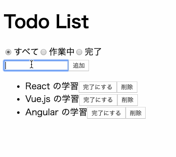

# Todo リストを実装する

React で実装した Todo リストのサンプルコード。



## 動作環境

- Node.js: v12.16.1
- npm: v6.14.4
- Yarn: v1.21.4

## 使い方

このサンプルではアプリケーションとモックサーバーを起動させる必要があります。

まずは、このディレクトリ上で以下のコマンドを実行してください。

```shell
yarn
```

### アプリケーションの起動

以下のコマンドを実行すれば、アプリケーションが起動してブラウザが自動的に立ち上がります。

```shell
yarn start
```

### モックサーバーの起動

以下のコマンドを実行すれば、モックサーバーが起動します。

```shell
yarn server
```
